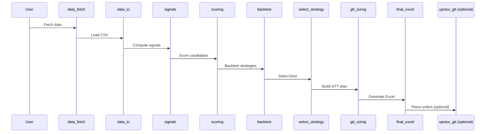
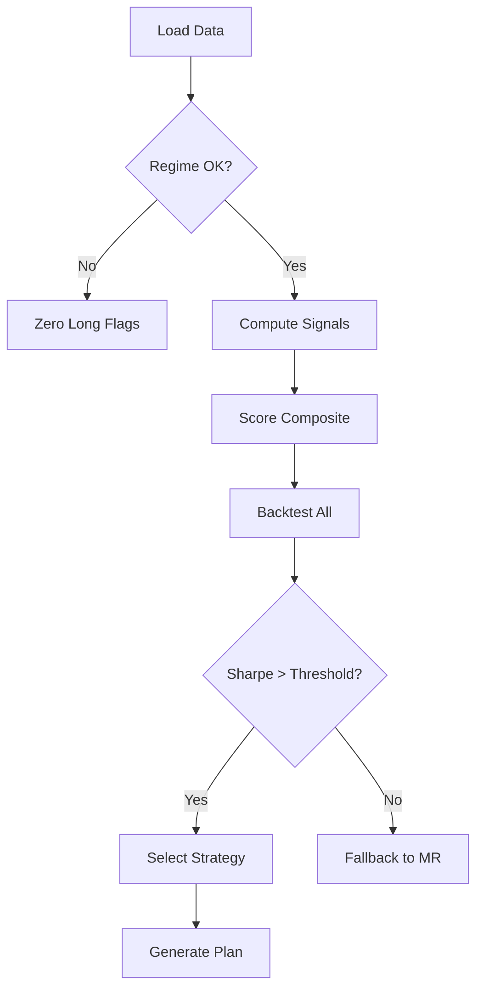
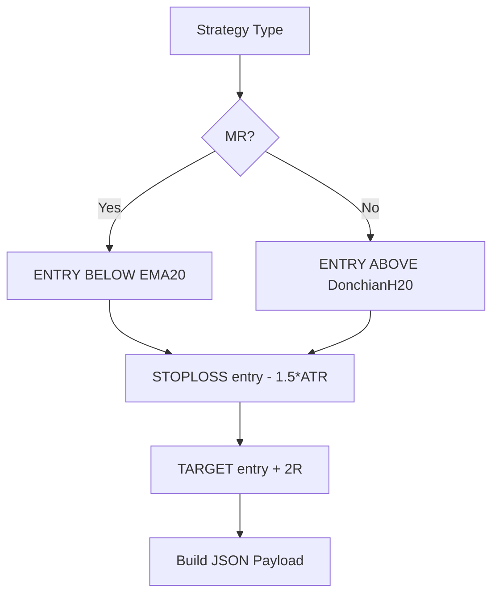

# NIFTY-GTT-Swing Logic Document

## 1) Executive Summary

The `nifty-gtt-swing` system is an automated pipeline for NIFTY50 swing trading strategy management in Delivery mode. It ingests 500-day indicator-enriched OHLCV data, computes regime-gated strategy signals (e.g., Mean Reversion, Breakouts), scores candidates by composite metrics, backtests strategies over historical data to select the best performer, generates GTT (Good Till Triggered) order plans with risk-managed sizing, and produces a final Excel for manual placement via Upstox API. Key outputs include a screener CSV with top candidates, backtest KPIs/trades per strategy, `selected_strategy.json`, GTT plan CSV, and final Excel (with empty-plan banner when no signals). Optional live placement via CLI handles retries, bulk submission, and EDIS validation for Delivery mode SELL legs.

## 2) Data Inputs & Assumptions

### Data Acquisition
Data is fetched live from Upstox API using `fetch-data` CLI command, retrieving 500 days of daily candles for NIFTY50 stocks. Indicators are computed on-the-fly and saved to CSV.

### Dataset Schema
The input CSV must contain the following columns for each trading day per symbol:
- `Date` (YYYY-MM-DD, monotonic ascending per symbol)
- `Symbol` (e.g., RELIANCE.NS)
- `Open`, `High`, `Low`, `Close`, `Volume` (float/int, OHLC sanity: H >= max(O,C), L <= min(O,C))
- `EMA20`, `EMA50`, `EMA200` (exponential MAs, require 200+ bars warmup)
- `RSI14` (0-100)
- `MACD`, `MACDSignal`, `MACDHist` (MACD components)
- `ATR14` (average true range)
- `BB_MA20`, `BB_Upper`, `BB_Lower`, `BB_BandWidth` (Bollinger Bands)
- `RVOL20` (relative volume)
- `DonchianH20`, `DonchianL20` (Donchian channels)
- `RS_vs_Index`, `RS_ROC20` (relative strength metrics)
- `KC_Upper`, `KC_Lower`, `Squeeze` (Keltner Channels and squeeze flag)
- `AVWAP60` (anchored VWAP)
- `IndexUpRegime` (1 if NIFTY > NIFTY_EMA50, else 0)

All timestamps are in Asia/Kolkata (IST) timezone. Data must be sorted by Symbol then Date. Validation: no NaN in core OHLC, dates monotonic, sufficient warmup bars (e.g., 200 for EMA200).

## 3) Signals & Strategy Logic

All long signals are gated by `IndexUpRegime == 1`. Thresholds are configurable in code.

### Flag Definitions
- `Trend_OK`: `(Close > EMA20) & (EMA20 > EMA50) & (EMA50 > EMA200)`
- `Minervini_Trend`: 8-point template (EMA150 > EMA200 > SMA200, RSI 40-70, etc.)
- `SEPA_Flag`: `Minervini_Trend & (BB_BandWidth <= BB_bw_p20_60) & (Close > DonchianH20) & (RVOL20 >= 1.5)`
- `VCP_Flag`: `(BB_slope20 < 0) & higher_lows(5) & Volume_Dry_Up & Pivot_Break & (RVOL20 >= 1.5)`
- `Donchian_Breakout`: `((Close > DonchianH20) | Pullback_to_Mid) & (RVOL20 >= 1.5)`
- `MR_Flag`: `Trend_OK & (RSI14 <= 35) & (abs(Close - EMA20) / Close <= 0.03)`
- `BBKC_Squeeze_Flag`: `BB_Inside_KC & (Close > KC_Upper) & (RVOL20 >= 1.5)`
- `SqueezeBreakout_Flag`: alias for BBKC_Squeeze_Flag
- `AVWAP_Reclaim_Flag`: `Trend_OK & (Close > AVWAP60)`
- `RS_Leader_Flag`: `(RS_ROC20 > 0) & (RS_ROC20 >= RS_p80_60)`
- `TS_Momentum_Flag`: `(TS_Momentum > 0)`

### Pseudocode for Signal Check
```python
for each row in df:
    if IndexUpRegime != 1:
        set all long_flags to 0
        continue
    compute Trend_OK as above
    compute SEPA_Flag as above
    # similarly for others
```

## 4) Composite Scoring & Screener

CompositeScore = 100 * (clipped_zscore(RS_ROC20) * 25 + clipped_zscore(RVOL20) * 20 + Trend_OK * 15 + Donchian_Breakout * 15) normalized to [0,100]

Where `clipped_zscore(x) = clip((x - mean)/std, -3, 3)`

No sector correlation penalty implemented. Screener outputs top 25 by CompositeScore, columns: Symbol, Close, EMA20, EMA50, EMA200, RSI14, ATR14, RVOL20, RS_ROC20, CompositeScore, [all flags].

## 5) Risk Model & Parameters

Default Delivery mode config:
- `equity`: ₹10L
- `risk_per_trade_pct`: 1.0%
- `stop_multiple_atr`: 1.5 (stop at entry - 1.5*ATR)
- `targets_r`: [2.0, 3.0] (partial exits at 2R/3R)
- `max_positions`: 8
- `max_per_sector`: 2
- `use_regime_gate`: true

ATR*1.5 provides ~1.5% risk buffer; 2R target balances win rate vs reward; regime gate avoids bear markets.

## 6) Backtest Engine

Event-driven: entry on signal close, stop at entry - 1.5*ATR, partial exits at 2R/3R, time-stop 20 bars. Adds 0.001% tx cost + 5bps slippage.

### Pseudocode
```python
equity = 100000
for each signal day:
    entry = close
    stop = entry - 1.5 * ATR
    qty = floor((equity * 0.01) / (entry - stop))
    exit_day = min(current + 20, last_day)
    exit_price = exit_day.close
    R = (exit_price - entry) / (entry - stop)
    pnl = qty * (exit_price - entry) - cost
    equity += pnl
```

KPIs: Win%, AvgR, ExpectancyR, MaxDD, Sharpe, Sortino, CAGR, TotalReturn, Exposure.

## 7) Strategy Selection

Backtest all strategies over last 500 days. Rank by Sharpe, tie-breaker ExpectancyR. Persist `selected_strategy.json` with results.

## 8) Walk-Forward Optimization (WFO)

Rolling/anchored WFO: IS window (252 days) → OOS window (63 days), repeat 8 cycles. Aggregate OOS Sharpe, MaxDD, Efficiency (OOS Sharpe / IS Sharpe).

## 9) Portfolio Construction

Risk parity: equal risk contribution over Top-N basket. Optional BL tilt: views from CompositeScore/RS, confidence scaling.

## 10) GTT Plan Mapping (Delivery mode)

- Breakout strategies (Donchian_Breakout, VCP, SEPA): ENTRY ABOVE DonchianH20
- MR: ENTRY BELOW EMA20
- STOPLOSS IMMEDIATE at entry - 1.5*ATR (tick-rounded to ₹0.05)
- TARGET IMMEDIATE at entry + 2*(entry - stop)
- Optional TSL: add `trailing_gap` to STOPLOSS leg

Example payload:
```json
{
  "type": "MULTIPLE",
  "quantity": 100,
  "product": "D",
  "instrument_token": "NSE_EQ|INE002A01018",
  "transaction_type": "BUY",
  "rules": [
    {"strategy": "ENTRY", "trigger_type": "ABOVE", "trigger_price": 2500.00},
    {"strategy": "TARGET", "trigger_type": "IMMEDIATE", "trigger_price": 2550.00},
    {"strategy": "STOPLOSS", "trigger_type": "IMMEDIATE", "trigger_price": 2475.00}
  ]
}
```

## 9) Final Excel Output (Delivery mode)

Columns: Symbol, GTT_Buy_Price, Stoploss, Sell_Rate, Strategy, Notes, Generated_At_IST

If plan empty: write "No actionable signals today" + run schedule banner.

Example rows:
| Symbol | GTT_Buy_Price | Stoploss | Sell_Rate | Strategy | Notes | Generated_At_IST |
|--------|---------------|----------|-----------|----------|-------|------------------|
| RELIANCE.NS | 2500.00 | 2475.00 | 2550.00 | MR |  | 2025-12-18 16:15:00 |

Banner: "Product: Delivery (D)\nENTRY trigger type per strategy: MR → BELOW EMA20; Breakout → ABOVE DonchianH20\nEnsure EDIS authorization is active for SELL legs"

## 10) CLI & Runbook

Commands: `fetch-data`, `screener`, `wfo`, `backtest`, `select`, `gtt-plan`, `final-excel`, `gtt-place`, `gtt-get`, `gtt-modify`

Schedules (IST, trading days Mon-Fri):
- Daily EOD 16:10–16:20: fetch-data → screener → wfo → backtest → select → gtt-plan → final-excel
- Weekly Mon EOD: full refresh
- Monthly 1st trading day EOD: robustness check

Example cron: `10 16 * * 1-5 /path/to/python -m src.cli final-excel --plan ...`

## 11) Failure Modes & Recoveries

Empty signals: normal, Excel banner. API errors: retry/backoff 3x, rate limit 1/sec. Proxy: set HTTP_PROXY/HTTPS_PROXY. EDIS: authorize in Upstox app for SELL.

## 12) Security & Compliance Notes

Store UPSTOX_ACCESS_TOKEN in .env, never log tokens. Log request IDs/order IDs.

## 13) Mermaid Diagrams

### a) Sequence Diagram


### b) Flow Diagram


### c) GTT Payload Mapping


## 14) Appendix: Tuning & Test/Demo Aids

MR relax: `mr_rsi_max=40`, `mr_ema_distance_max=0.05`. Historic plan: filter df by date. Fallback: Donchian_Breakout → SEPA → VCP.</content>
<parameter name="filePath">c:\Users\K01340\SWING_BOT\SWING_BOT\nifty-gtt-swing\docs\LOGIC.md